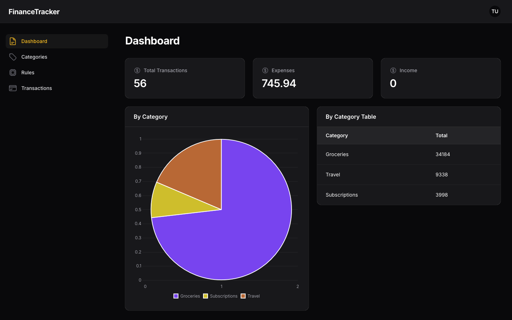

# Finance Tracker

A laravel project to track your finances. Features include:
- Transaction tracking
- Categorisation
- File uploads (WIP)
- Tagging (WIP)
- Reporting (WIP)

## Installation

**Requirements:**  
- Redis (for Queued Jobs)

**Steps:**  
1. Clone the repository
2. Run `composer install`
3. Run `npm install`
4. Run `php artisan migrate`
5. Run `npm run dev`

## Usage

1. Run `php artisan db:seed` to seed the database with some test data
2. Navigate to the homepage and login with the test user:
    - Email: test@email.com
    - Password: password

## Screenshots

### Dashboard

## Contributing

**Pull requests are welcome!**

For major changes, please open an issue first to discuss further changes.

## License

This project is open-sourced software licensed under the [GNU General Public License v3.0](https://www.gnu.org/licenses/gpl-3.0.en.html).
